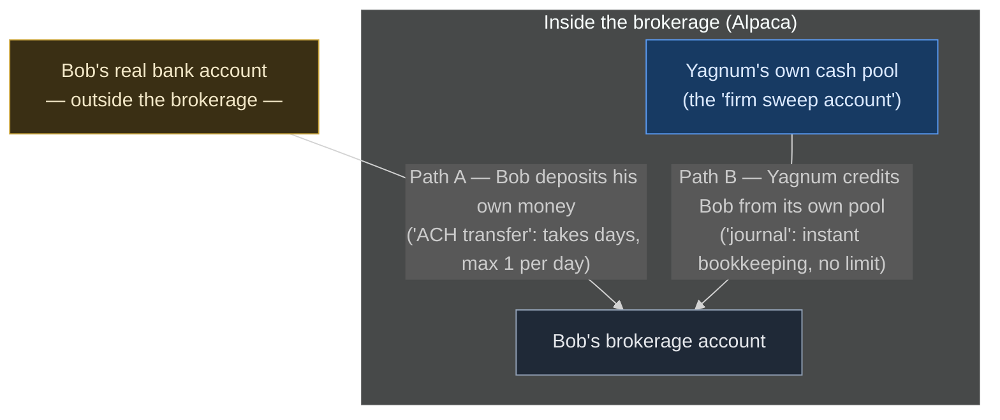

# How Money Moves: Firm Accounts, Journals, and Funding on Alpaca

This explains how funding actually works in Yagnum — what a firm account is,
what a journal is, why we fund accounts the way we do (ADR-011), and how the
same machinery connects to the ERR concept in the research paper.

## 1. The cast of accounts

When you build on Alpaca's **Broker API**, you are playing the role the
industry calls a **correspondent**: a fintech that offers brokerage accounts
to its users while Alpaca (the clearing broker) does the regulated heavy
lifting — custody, execution, compliance. Under your correspondent umbrella
live two kinds of accounts:

Three terms before the picture, in plain words:

- **ACH** — the standard system US banks use to move money between accounts.
  It's what's behind direct deposit and "link your bank account". Batched and
  slow: real transfers take 1–3 business days. (A **wire** is its faster,
  expensive sibling — same idea, same-day. We don't use wires.)
- **Journal** — not a bank transfer at all. It's the broker editing its own
  ledger: "reduce this account by $X, increase that one by $X." Nothing
  leaves the building, so it's instant. `JNLC` is just Alpaca's code for
  "journal, cash flavor" (there's also `JNLS` for journaling shares).
- **Sweep account** — the operator's (our!) own pool of cash *inside* the
  brokerage, sitting alongside the customers' accounts.

The whole picture is then one idea: **money crossing the brokerage boundary
is slow and limited; money moving inside it is instant bookkeeping.** Both
paths can reach the *same* customer — they are two rails into one account,
not two kinds of customer:



At a real-money fintech, a single deposit often uses **both rails at once**:
Bob starts a Path A deposit from his bank, and the firm immediately runs
Path B so his balance updates now, repaying its pool when Path A clears days
later. That combination is what "instant deposits" are (§4).

**Why Yagnum uses only Path B**: in a paper-trading app there is no real
money anywhere — Bob never connects a real bank, so Path A has nothing real
to carry. The only "cash" that exists is the simulated pool in the sweep
account, and funding an account can only ever mean journaling from it. (The
sandbox does let us *simulate* Path A, which is how we discovered its delays
and daily limit.)

- **Client accounts** — what `POST /v1/accounts` creates, one per signed-up
  user. This is where a user's cash and positions live. Each is an individual
  brokerage account in that user's name.
- **Firm accounts** — accounts that belong to *you, the operator*, not to any
  customer. The important one is the **sweep account**: the operator's pool of
  cash inside the brokerage. Firm accounts don't appear in `GET /v1/accounts`
  (that endpoint lists only client accounts) — you find them in the Broker
  dashboard under **Accounts → Firm Accounts**.

## 2. Two ways money enters a client account

### Path A — ACH transfer (money crosses the brokerage boundary)

ACH is the real-world rail: money leaves an actual bank account, travels the
NACHA network, and lands at the broker. It has two steps in Alpaca's API:

1. **ACH relationship** (`POST .../ach_relationships`) — link a bank account
   (in production this is a Plaid-style verification; in sandbox, fake
   numbers). The relationship starts `QUEUED` and must become `APPROVED`.
2. **Transfer** (`POST .../transfers`) — move a dollar amount across the
   linked relationship. It walks a lifecycle:
   `QUEUED → APPROVAL_PENDING → PENDING → SENT_TO_CLEARING → COMPLETE`.

That lifecycle is not bureaucratic decoration — it mirrors reality. Real ACH
settles in batches over **1–3 business days**. And brokers impose limits:
Alpaca allows **one ACH transfer per direction per trading day** per account.

We verified both facts empirically (2026-08-24): our sandbox relationship sat
`QUEUED` for ~5 minutes before approving, the transfer crawled through the
pipeline for minutes more, and a second same-day transfer was rejected with
*"maximum number of ACH transfers allowed is 1 per trading day"*. The docs'
claim that sandbox transfers credit "immediately" did not survive contact
with the actual system.

### Path B — Journal (money moves inside the brokerage)

A **journal** is a pure ledger operation: no bank, no ACH network, no
clearing. It says "move value from account X to account Y **on the broker's
books**" — both accounts are already inside the same brokerage, so nothing
physically moves anywhere. Two flavors:

- **JNLC** — journal *cash* (what we use)
- **JNLS** — journal *securities* (moves shares; we'll meet this again later)

Because it's just bookkeeping, a journal is **instant** and has **no daily
cap**. The API call is one request:

```
POST /v1/journals
{
  "from_account": "<firm sweep account id>",
  "to_account":   "<the user's account id>",
  "entry_type":   "JNLC",
  "amount":       "10000"
}
```

One restriction we hit directly: **customer-to-customer journals are
disabled** (`"customer-to-customer JNLC not enabled"`). Journals must involve
a firm account. That's a compliance guardrail — if any customer could journal
cash to any other customer, your brokerage would quietly become an
unregulated money-transmission network.

## 3. How this maps to Yagnum's code

`app/api/alpaca.py` implements both paths, and `fund_account()` picks:

| Condition | Path | Behavior |
| --- | --- | --- |
| `ALPACA_FIRM_ACCOUNT_ID` set in `.env` | `create_journal()` — JNLC from the sweep account | Instant, unlimited |
| Not set | `ensure_ach_relationship()` + `create_transfer()` | 1/day, minutes to clear |

Both return the same `{id, status, amount}` shape, so `routes_funding.py`
and the frontend never know which rail ran. In sandbox, the sweep account's
simulated cash is effectively bottomless, so "the firm fronts the money" is
free. (In production it would be *your company's real dollars* — see §5.)

## 4. Why real fintechs do exactly this: "instant deposits"

When Robinhood or Webull credits your deposit "instantly" while the ACH
actually settles days later, this is the machinery: **the firm journals its
own cash to you now, and repays itself from your ACH when it clears.** The
firm is extending you short-term credit, wearing the settlement risk (your
ACH might bounce) in exchange for a better user experience.

Read that sentence again, because it is the Yagnum paper in miniature:

> *An operator fronts immediate liquidity from its own reserve, warehouses
> the settlement risk across a time gap, and reconciles when the slow,
> official rail finally settles.*

That is exactly what the **ERR** does for weekend trades — Jupiter execution
now, NYSE settlement Monday, a reserve absorbing the difference in between.
Instant deposits are ERR for cash instead of equities. When you demo Yagnum
and someone asks "is this settlement-gap idea real?", the answer is: you've
used it every time a deposit showed up instantly.

## 5. The double-entry view (why "journal" is called journal)

"Journal" is 500-year-old accounting vocabulary: the book where every entry
is recorded twice — a debit to one account, an equal credit to another, so
the books always balance (the paper's **Invariant 2**). An Alpaca JNLC is
literally one double-entry record:

```
  Debit:  firm sweep account   $10,000
  Credit: Alice's account      $10,000
  ──────────────────────────────────────
  Net change across the brokerage: $0
```

Money is never created or destroyed inside the brokerage — only moved. When
we build Yagnum's own ledger (the IBOR from the paper), it will be a table of
exactly such entries, and reconciliation will mean proving that our entries
and Alpaca's entries tell the same story. In production, the sweep account's
balance is real corporate money, which is why "how big must the reserve be?"
(the paper's ERR-sizing question) is a real research problem and not an
academic exercise.

## 6. Setup checklist

1. Broker dashboard → **Accounts → Firm Accounts** → copy the **sweep**
   account's ID (a UUID).
2. Put it in the repo-root `.env` as `ALPACA_FIRM_ACCOUNT_ID=...`
3. Restart the API. Funding is now instant; nothing else changes.

If the value is missing, the code silently falls back to ACH — worse UX,
still correct.

## 7. Sandbox facts we verified empirically (2026-08-24)

- The sweep account **cannot overdraw**: journaling more than its balance
  fails with `403 transferable balance is insufficient`. The firm pool is a
  real constraint even in sandbox.
- **Customer → firm journals are allowed** and execute instantly (it's the
  customer → customer direction that's disabled). This is the fee-collection
  direction, and it's how the consolidation script
  (`app/api/scripts/consolidate_sandbox_cash.py`) tops up the sweep account
  from idle test-account balances.
- Sandbox ACH is a faithful simulation, not a shortcut: ~5 min relationship
  approval, ~6.5 min clearing, 1 transfer per direction per day.
- ACH deposits are capped at **$50,000 per account per day** (a $1B attempt
  is refused with "maximum total daily transfer allowed is $50000"). The cap
  is **per account**, verified by a second account depositing $50k the same
  day — so N conduit accounts yield N × $50k/day
  (`app/api/scripts/treasury_faucet.py`).
- The firm pool is therefore replenished two ways: one-time consolidation of
  idle test balances (§7 script), plus the conduit faucet for a renewable
  ~$50k/day per conduit.
- **Journals are only instant up to $50.** Probed empirically: $25 and $50
  execute immediately; $100+ goes `queued → pending` and settles in the
  end-of-day batch. This matches the docs' "default maximum amount for
  journals is $50" — the word *default* suggests real correspondents
  negotiate higher limits. Sandbox fixtures (`/fixtures/status=.../fixtures/`
  in the description) control the EOD *outcome*, not the timing — verified:
  a $100 journal with an `executed` fixture still queued.
- Consequence for the app: a $10,000 funding journal is NOT instant by
  default — it lands at EOD. The limits ARE configurable: Broker dashboard →
  Team Settings → **Sandbox Configurations** exposes "JNLC Transaction
  Limit" (default $50), "JNLC Daily Transfer Limit" (default $10,000) and
  "Firm Account Daily Transfer Limit" (default $50,000). We set them to
  $100,000 / $500,000 / $1,000,000.
- A journal **debits the source at creation and credits the target at
  execution**. That is why the sweep account looked poorer while the
  consolidation batch sat pending, and why conduit accounts zeroed at once.
- The app now shows "Deposit pending" (not "complete") whenever the broker
  returns any status other than executed/complete.

## 8. How this works with real money (the production answer)

"How fast is a transfer?" has four answers in the US:

| Rail | Speed | Available | Cost | Cap |
| --- | --- | --- | --- | --- |
| ACH (standard) | 1–3 business days | business days | ~$0.10–0.50 | varies by bank |
| Same-day ACH | hours | business days | ~$1 | $1M per payment |
| Wire (Fedwire) | minutes–1 hour | business hours | $15–35 | effectively none |
| RTP / FedNow | seconds | **24/7/365** | cents | $1M / ~$500k |

But real fintechs mostly don't solve deposit latency with faster rails —
they solve it with a **prefunded buffer**:

1. **Prefund**: keep an operating balance at the broker sized to expected
   flows plus a spike margin. Sizing it is a forecasting problem — demand
   distribution × confidence level — which is the same `σ · z_α` math as the
   paper's ERR sizing, applied to cash.
2. **Replenish on thresholds, not errors**: when the pool crosses the refill
   line, treasury wires more in during business hours. Users never notice.
3. **"Instant" is credit, not speed**: the user's balance is credited from
   the pool immediately (a journal) while their slow ACH repays the firm
   over 1–3 days. The firm briefly lends the money and carries the risk of
   the ACH bouncing. This is what instant deposits at Robinhood/Venmo are.

Note the "Available" column: ACH and Fedwire **close on weekends** — cash
settlement has the same discontinuity as equity settlement, papered over
industry-wide with prefunded buffers and credit. The genuinely 24/7 rails
are RTP/FedNow — and stablecoins: USDC on Solana settles in seconds at 3 AM
on a Sunday, which is why the paper's emergency reserve (§6c, Level 3) is
denominated in USDC. Yagnum's thesis — official rails are discontinuous, so
someone fronts liquidity across the gap and reconciles later — is how money
already works; the project applies it to a gap nobody has bridged.
