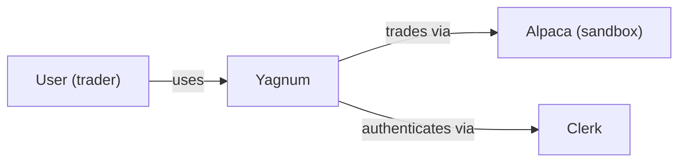
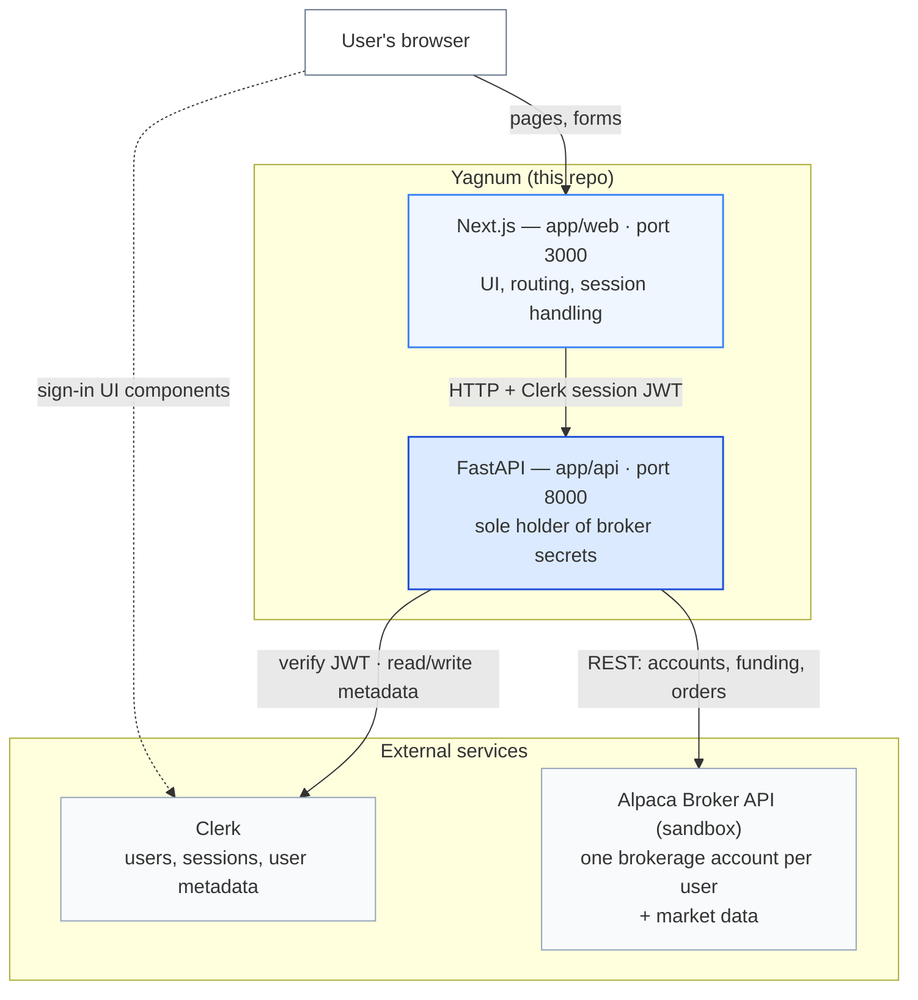
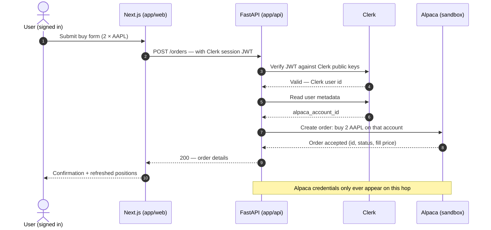

# Yagnum — MVP Architecture

This describes the **Phase 0–4 MVP**: a paper-trading web app on Alpaca's
Broker API sandbox. The crypto/Jupiter/ERR layers from the research paper
come later and will extend — not replace — this foundation.

We use the [C4 model](https://c4model.com) vocabulary: a **context diagram**
shows our system vs. the outside world; a **container diagram** shows the
separately-runnable pieces inside it. Diagrams are Mermaid (GitHub renders
them inline); exported SVGs live in `docs/diagrams/` for the paper.

For *why* each technology was chosen, see [DECISIONS.md](DECISIONS.md).
For the trade loop, the Alpaca calls, and the no-database design, see
[TRADING-FLOW.md](TRADING-FLOW.md). For funding, see [ALPACA-FUNDING.md](ALPACA-FUNDING.md).

## Level 1 — System context



## Level 2 — Containers



## The security pattern that shapes everything

**The browser never talks to Alpaca.** Only FastAPI holds the Alpaca keys.
Each request from the frontend carries the user's Clerk session token (a JWT);
FastAPI verifies it against Clerk's public keys, looks up that user's Alpaca
account ID (stored in Clerk user metadata — see ADR-003), and acts on exactly
that account. A user can therefore never touch another user's account, and the
secrets never reach client-side code.

## Request walk-through: "Buy 2 AAPL"



## API contract (Phase 1)

All endpoints except `/health` require `Authorization: Bearer <Clerk JWT>`.
Monetary values are **strings**, never floats (see ADR-010).

| Endpoint | Purpose | Response |
| --- | --- | --- |
| `GET /health` | Liveness + config check (public) | `{status, service, alpaca_keys_loaded}` |
| `POST /accounts` | Idempotent Alpaca account provisioning | `{alpaca_account_id, created, status}` |
| `GET /accounts/me` | Account summary | `{alpaca_account_id, status, currency, cash, buying_power, portfolio_value, equity}` · `404 no_account` |
| `POST /funding` | Fund the paper account (sandbox) | `{transfer_id, status, amount}` |

## API contract (Phases 2–3)

Same auth rule. Full request and response schemas live in Swagger at
`http://localhost:8000/docs` and in `docs/postman/`.

| Endpoint | Purpose |
| --- | --- |
| `GET /market/clock` | Market open/closed, next open and close |
| `GET /market/assets?q=` | Symbol and name search (cached asset list) |
| `GET /market/quotes/{symbol}` | Latest bid, ask, and last trade |
| `GET /market/bars/{symbol}?timeframe=&limit=` | OHLCV bars for charts |
| `POST /orders` · `GET /orders` · `GET /orders/{id}` · `DELETE /orders/{id}` | Place, list, inspect, cancel orders |
| `GET /positions` | Open positions with unrealized P/L |
| `GET /portfolio/history?period=&timeframe=` | Equity over time |
| `GET /activities` · `GET /activities/export.csv` | Transaction history and CSV statement |
| `GET /documents` · `GET /documents/{id}/download` | Alpaca-issued documents |

ADR-014 additions: `GET /pnl/realized` (FIFO realized profit), a
`realized_pl` field on activity rows and the CSV, an optional
`Idempotency-Key` header on `POST /orders`, and an `X-Request-ID` header on
every response (join key to the `audit_log` table). Later joined by
`GET /pnl/preview?symbol=&qty=` — the read-only FIFO cost basis of a
prospective sell, so the order ticket can estimate the gain before the
trade with the same method History records after it.

ADR-016 addition: `GET /market/token/{symbol}` — the xStock that mirrors a
listed share, priced live on Jupiter beside Alpaca's last trade, with the
signed gap between them. 404 `no_token` for symbols without one. Read-only:
Yagnum never trades the token. The sampler (`scripts/sample_prices.py`, a
GitHub Actions cron) records the same pair every five minutes into
`token_prices`; `scripts/backfill_history.py` fills `token_candles` and
`market_bars` from GeckoTerminal and Alpaca for the research notebook.

ADR-015 additions: `POST /accounts/reset` (sell everything, return the
cash to the firm sweep, land at $0 — each call reports `liquidating` or
`reset` and the client polls by re-calling) and `POST /webhooks/clerk`
(Clerk `user.deleted` → ADR-013 account closure; authenticated by Svix
signature instead of a Clerk token, completed across Svix's retry
schedule while liquidation waits for market open).

Developer tools: `scripts/dev_token.py` mints a one-hour Clerk token for
Swagger and Postman. `scripts/make_postman.py` regenerates the collection.
Database: Neon Postgres (`development` branch for local work), migrations
via `uv run alembic upgrade head` in `app/api`.

## Phases

- **Phase 0 — Foundations** ✅: scaffold, docs, health-check plumbing.
- **Phase 1 — Identity & onboarding** ✅ verified live in a browser (2026-08-24): Clerk sign-in → Alpaca account created → $10,000 deposit accepted → dashboard renders. Journal deposits settle after the sandbox journal limits were raised (ALPACA-FUNDING.md §7).
- **Phase 2 — Trading core** ✅ verified with live fills (2026-08-27): symbol lookup + quotes, buy/sell by quantity, order status, cancel.
- **Phase 3 — Dashboard** ✅ verified with live fills (2026-08-27): positions, portfolio chart, order history, activities, CSV export.
- **Phase 4 — Production polish**: Postgres per ADR-014 ✅ (audit log, order idempotency, fills ledger for realized P/L — live 2026-08-27); Clerk `user.deleted` offboarding webhook and reset-balance per ADR-015 ✅ (code + tests 2026-08-27; the webhook registers with Clerk once the API has a public URL); production Clerk config (checklist in `docs/PRODUCTION.md`); deployment to Azure.
- **Phase 5+ — Paper territory**: market-hours awareness, Jupiter integration, ERR engine, gap-volatility research (`notebooks/`).

## Running locally

```
# Terminal 1 — API
cd app/api && uv run uvicorn main:app --reload

# Terminal 2 — Web
cd app/web && npm run dev
```

Then open http://localhost:3000.
