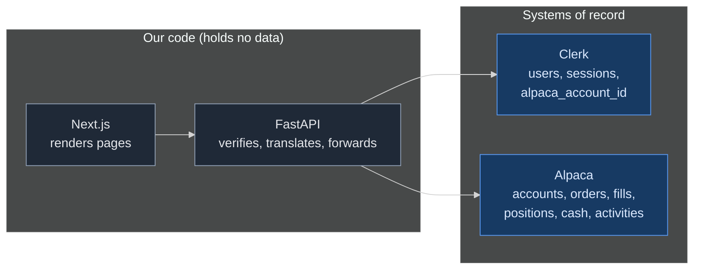
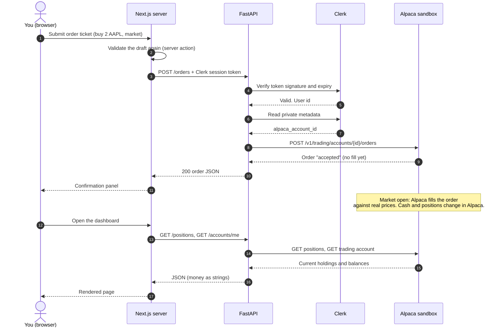

# How Trading Works in Yagnum

This document explains the technical loop behind a trade. It covers:

- where the data lives, and why there is no database yet
- the buy and sell loop, step by step
- every Alpaca call that we make
- how FastAPI handles one call
- how the dashboard stays current
- when a database becomes necessary
- how to use Swagger and Postman

## 1. Where the data lives

Our code holds no data. It reads and writes two external systems of record.

| Fact | Where it lives | Who writes it |
| --- | --- | --- |
| Who you are, your session | Clerk | Clerk |
| Which Alpaca account is yours | Clerk private metadata | FastAPI, once, at provisioning |
| Cash, buying power, equity | Alpaca | Alpaca, on every fill and deposit |
| Orders and their status | Alpaca | Alpaca |
| Positions | Alpaca | Alpaca |
| Transaction history | Alpaca activities | Alpaca |

Alpaca is a brokerage. A brokerage keeps the ledger. That is its job. If we kept a copy, we would have two ledgers that can disagree. So the dashboard does not "keep track" of anything. On every page load, it asks Alpaca for the current truth.

One exception: FastAPI caches the list of tradable symbols in memory for 15 minutes. The list has about 14,000 rows and changes rarely.

## 2. The buy loop

Step by step:

1. **The ticket validates in the browser.** `lib/orders.ts` checks the symbol, the quantity, and the limit price. The button stays disabled until the draft is valid.
2. **The review step.** The ticket shows a summary. Nothing is sent yet.
3. **The server action validates again.** `submitOrder` in `lib/actions.ts` runs the same validator. A server action is a public endpoint, so it must not trust the browser.
4. **FastAPI receives `POST /orders`.** The request carries the Clerk session token.
5. **FastAPI verifies the token** with Clerk's public keys. It reads the user id from the token.
6. **FastAPI reads the Alpaca account id** from the user's Clerk metadata.
7. **FastAPI sends the order to Alpaca**: `POST /v1/trading/accounts/{account_id}/orders`. The body is `{symbol, qty, side, type, time_in_force, limit_price}`.
8. **Alpaca answers at once** with status `accepted`. The order is not filled yet.
9. **Alpaca fills the order** during market hours, against real market data. This can take a fraction of a second or, for a limit order, days.
10. **Cash and positions change inside Alpaca.** We learn about it on the next read.

### The sell loop

A sell is the same loop with `side: "sell"`. Alpaca checks that you hold the shares. If you do not, Alpaca rejects the order and we show its message.

### Order states

| Status | Meaning |
| --- | --- |
| `accepted`, `new` | Alpaca has the order. Nothing filled. |
| `partially_filled` | Some shares filled. The rest works. |
| `filled` | Done. Cash and positions changed. |
| `canceled` | You canceled it before a fill. |
| `rejected` | Alpaca refused it (buying power, symbol, market rules). |
| `expired` | A day order reached the end of the session unfilled. |

A market order fills at the open if the market is closed. A limit order fills only when the market reaches your price.

## 3. Every Alpaca call that we make

| Our route | Alpaca endpoint | Purpose |
| --- | --- | --- |
| `POST /accounts` | `POST /v1/accounts` | Open a brokerage account |
| `GET /accounts/me` | `GET /v1/trading/accounts/{id}/account` | Cash, buying power, equity |
| `POST /funding` | `POST /v1/journals` | Move simulated cash from the firm account |
| `GET /market/clock` | `GET /v1/clock` | Open or closed, next open |
| `GET /market/assets` | `GET /v1/assets` | Tradable symbols (cached) |
| `GET /market/quotes/{symbol}` | `GET /v2/stocks/{symbol}/quotes/latest` and `/trades/latest` | Bid, ask, last trade |
| `GET /market/bars/{symbol}` | `GET /v2/stocks/{symbol}/bars` | Candles for the chart |
| `POST /orders` | `POST /v1/trading/accounts/{id}/orders` | Place an order |
| `GET /orders` | `GET /v1/trading/accounts/{id}/orders` | List orders |
| `DELETE /orders/{id}` | `DELETE /v1/trading/accounts/{id}/orders/{order_id}` | Cancel |
| `GET /positions` | `GET /v1/trading/accounts/{id}/positions` | Holdings |
| `GET /portfolio/history` | `GET /v1/trading/accounts/{id}/account/portfolio/history` | Equity over time |
| `GET /activities` | `GET /v1/accounts/activities?account_id=` | Fills, deposits, journals |
| `GET /documents` | `GET /v1/accounts/{id}/documents` | Statements |

Two hosts are involved. The Broker API is at `broker-api.sandbox.alpaca.markets`. Market data is at `data.sandbox.alpaca.markets`. Both accept the same credentials.

## 4. How FastAPI handles one call

Every protected route runs the same chain before its own code:

1. `HTTPBearer` reads the `Authorization` header.
2. `require_user_id` asks the Clerk SDK to verify the token. A bad token is a 401.
3. `require_account_id` reads the Alpaca account id from Clerk metadata. A missing id is a 404 `no_account`.
4. Pydantic validates the request body. A bad body is a 422 with field-level messages.
5. The route calls one function in `alpaca.py`.
6. `alpaca.py` sends the HTTP request with the broker credentials and a 30-second timeout.
7. An Alpaca error becomes one of our errors:

| Alpaca answers | We answer | Why |
| --- | --- | --- |
| 401 or 403 (bad keys) | 502 `alpaca_auth_failed` | Our configuration is wrong, not the caller's |
| 403 or 422 on an order | 400 `alpaca_rejected: <message>` | The broker refused. The message is shown verbatim. |
| 404 | 404 `alpaca_not_found` | Wrong id |
| timeout or network | 504 `alpaca_unreachable` | Retry later |

Money never becomes a float on this path. Alpaca sends strings. We forward strings. Market data sends JSON numbers, and we decode them with a hook that keeps them as text.

## 5. How the dashboard stays current

The dashboard is a **read model**. It asks and displays. It stores nothing.

- **First paint**: a Next.js server component calls FastAPI and renders HTML. The browser receives finished numbers.
- **Live updates**: client components poll through `/api/proxy/*`. The proxy runs on the Next.js server, attaches your Clerk token, and forwards the call. The browser never sees the API URL or the token.
- **Intervals**: quotes every 5 seconds while the market is open, 30 seconds when closed. Orders every 10 seconds while an order works.
- **After an action**: the server action calls `revalidatePath` so the next visit re-renders with fresh data.

## 6. When a database becomes necessary

Not yet. Today a database would hold copies of Alpaca's data, and copies drift. It becomes necessary when we must store something that Alpaca does not know:

| Need | Phase | Why Alpaca cannot hold it |
| --- | --- | --- |
| Idempotency keys for orders | 4 | A retried request must not place two orders |
| Our own audit log | 4 | Who did what, when, from where |
| User preferences | 4 | Default order size, watchlists |
| ERR records and reconciliation state | 5 | This is Yagnum's own invention |
| The double-entry ledger (paper, Invariant 2) | 5 | Two venues, one book |
| A cache for rate limits | 5 | Alpaca allows about 200 requests per minute |

The right moment is the start of Phase 4. The first table is the audit log, because it is the simplest and it protects everything after it. Postgres is the choice, per ADR-003.

## 7. Swagger and Postman

Swagger:

1. Start the API: `cd app/api && uv run uvicorn main:app --reload`
2. Open `http://localhost:8000/docs`
3. Mint a token: `uv run python scripts/dev_token.py`
4. Click **Authorize**, paste the token, click **Authorize** again.
5. Open any route, click **Try it out**, click **Execute**.

The token lasts one hour. Mint a new one when calls return 401.

Postman: follow the five steps in `docs/postman/README.md`. The collection covers every route.

Exercise: place a limit buy for 1 AAPL at $1.00 through Swagger. It will not fill. List it, then cancel it. You have now run the full loop by hand.
