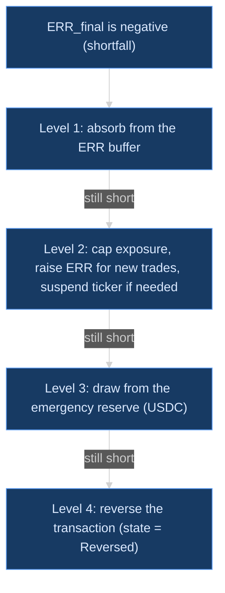

# Yagnum, Explained

A plain-language guide to Project Yagnum, with the formulas as a quick reference.
Source of truth: the academic proposal (v4, August 2026). This document restates it. It does not change it.

Reading time: about 15 minutes.

**Running example used throughout.** NVDA is the Nvidia share. NVDAx is the token that represents one NVDA share on Solana. On Saturday, NVDAx trades on Jupiter at **$226**. On Monday, the first liquid regulated execution of NVDA fills at **$223**. The trade size is **10 shares**.

---

## 1. The problem

US stock markets (NYSE, NASDAQ) are open Monday to Friday, 9:30 AM to 4:00 PM ET. They are closed at night, all weekend, and on holidays. Tokenized stocks are different. A tokenized stock is a digital token, held on a blockchain, that is backed one-to-one by a real share in a custody account. On Solana, these tokens are called **xStocks**. They trade 24 hours a day, 7 days a week, through **Jupiter**. Jupiter is a trading venue on Solana that routes each trade to the pool with the best price. So a person can sell NVDAx at 11 PM on Saturday. But the real NVDA share cannot change hands until Monday. **Settlement** is the moment the real share and the real dollars finally move. A weekend token trade has no real-share settlement until Monday. That creates two prices for one trade:

| Symbol | Name | When it is known |
| --- | --- | --- |
| **P_JUP** | The Jupiter price of the token at the weekend trade | Now, at the moment of the trade |
| **P_MKT** | The price at which the broker fills the real share on Monday | Only on Monday, when the order fills |

In our example, P_JUP = $226 and P_MKT = $223. The gap is $3 per share. Yagnum exists to handle that gap safely.

---

## 2. What Yagnum is, and is not

Yagnum is a **settlement orchestration framework**. In plain words: it is the coordinator that connects a weekend token trade to the Monday share trade, and makes the money add up.

| Yagnum IS | Yagnum IS NOT |
| --- | --- |
| A settlement layer that sits between Jupiter and a regulated broker | A token issuer. Backed Finance issues xStocks. Yagnum does not **mint** (create) tokens. |
| A user of Jupiter for execution | An AMM. An **AMM** (automated market maker) is a pool of tokens that sets prices by formula. Jupiter already routes to these. Yagnum does not build one. |
| A user of existing **liquidity** (the supply of buyers and sellers ready to trade now) | A provider of its own liquidity pools |
| The owner of the ERR escrow and the reconciliation ledger | A speculator or a trading strategy |

The core design rule is: **execution and settlement are separated in time.** Jupiter gives the trader immediate execution. Yagnum gives the trade its real settlement when the market reopens.

---

## 3. The hedge

This section answers the question: "Why does Yagnum do the opposite trade, and why does it lose money?"

### 3a. What a hedge is

A **hedge** is a second trade that offsets the risk of a first trade. If you own something and its price can fall, a hedge is a position that gains when the price falls. The gain on the hedge cancels the loss on the thing you own. A perfect hedge leaves you with no exposure. **Exposure** means "money at risk if the price moves".

### 3b. Why Yagnum takes the opposite side

Every trade needs two sides. When the trader sells 10 NVDAx on Saturday, somebody must buy them. That somebody is the **counterparty**. Nobody can settle the real share on Saturday. So Yagnum steps in as the counterparty. It buys the 10 NVDAx at $226 at the same moment the trader sells. Yagnum now holds the exposure: it owns tokens whose value follows NVDA, and NVDA cannot be sold until Monday. On Monday, Yagnum sells 10 NVDA through the broker at the first liquid regulated execution: premarket when liquid enough, otherwise the 9:30 auction. (**Premarket** is the early session, from 4:00 AM ET, where limit orders can trade before the main market opens.) That Monday sale closes the exposure. Both legs are now done. The hedge is complete.

The buy direction is the mirror image. The trader buys 10 NVDAx on Saturday. Yagnum sells 10 NVDAx to the trader. Yagnum is now short: it is exposed to NVDA going up. On Monday, Yagnum buys 10 NVDA through the broker to close the exposure.

Here is the vocabulary for the diagram below. **Contra side** means the opposite side of the trader's trade. **Escrow** is money set aside and locked until a condition is met. **ERR** is the Execution Reconciliation Reserve, the escrow Yagnum uses. **Reconcile** means to compare the two prices and settle the difference.

### 3c. Yagnum is not trying to profit

Yagnum opens the hedge at P_JUP and closes it at P_MKT. Its profit or loss on the hedge is only the weekend price gap. Sometimes the gap is in Yagnum's favor. Sometimes it is against Yagnum. Nobody knows which on Saturday. Over many trades, the gap is close to zero on average. Yagnum does not choose which trades to take. It does not hold a view on the price. It is an **intermediary**, a party in the middle, not a speculator. The proposal states this directly: Yagnum "is not a speculative trading protocol".

There is a second reason Yagnum does not profit. When the gap goes in Yagnum's favor, the gain is **refunded to the trader** through the ERR (see Section 3e). Yagnum keeps neither the gain nor the loss. It passes both through.

### 3d. The honest answer to "why do we lose money?"

The loss is the **cost of promising immediate execution against a market that is closed**. The trader wants cash on Saturday at Saturday's price. The real share can only be sold on Monday at Monday's price. Those two prices differ. Someone must carry the difference over the weekend. That someone is Yagnum, because Yagnum is the one holding the exposure.

The ERR is how the trader pre-funds that carry. When the trader trades on Saturday, an escrow is locked. It is sized to cover a bad weekend gap with high confidence. On Monday, the real gap is known. If the gap cost less than the escrow, the surplus is refunded. If the gap cost more, the shortfall cascade applies (Section 4f). So Yagnum does not bear the gap risk unbounded. The trader bears it, up to the escrow, and the trader gets back everything not used.

One way to say it in one sentence: **the ERR makes the trader's true price equal to Monday's price, while giving the trader the cash on Saturday.** The worked numbers below show this.

### 3e. Both directions, with numbers

Assumptions for all cases: Q = 10 shares. Fees_est = $2. Fees_actual = $2. ERR_initial = $105.14 + $2 = **$107.14** (Section 4e shows how). All prices are per share.

**Case 1. Trader SELLS on Saturday at $226. Monday's fill is $223.**

- Trader's view: receives 10 × $226 = $2,260 on Saturday. Locks $107.14 in the ERR.
- Yagnum's view: buys 10 NVDAx at $226 (cost $2,260). Sells 10 NVDA on Monday at $223 (receives $2,230). Gross loss: **−$30**. After $2 fees: **−$32**.
- ERR_final = $107.14 − $32 = **$75.14**. This is refunded to the trader.
- Trader's net: $2,260 − $107.14 + $75.14 = $2,228. That is 10 × $223 − $2 fees. The trader's true price is Monday's $223.
- Who lost the $30? In net terms, the trader's escrow paid it. Yagnum is flat.

**Case 2. Trader SELLS on Saturday at $226. Monday's fill is $229.**

- Yagnum's view: buys at $226, sells at $229. Gross gain: **+$30**. Net: **+$28**.
- ERR_final = $107.14 + $28 = **$135.14**. All of it is refunded to the trader.
- Trader's net: $2,260 − $107.14 + $135.14 = $2,288 = 10 × $229 − $2. Again, the trader's true price is Monday's price.

**Case 3. Trader BUYS on Saturday at $226. Monday's fill is $223.**

- Trader's view: pays $2,260 for 10 NVDAx. Locks $107.14 in the ERR.
- Yagnum's view: sells 10 NVDAx at $226 (receives $2,260). Buys 10 NVDA on Monday at $223 (pays $2,230). Gross gain: **+$30**. Net: **+$28**.
- ERR_final = $107.14 + $28 = **$135.14**, refunded. Trader's net cost: $2,260 + $107.14 − $135.14 = $2,232 = 10 × $223 + $2.

**Case 4. Trader BUYS on Saturday at $226. Monday's fill is $229.**

- Yagnum's view: sells at $226, buys back at $229. Gross loss: **−$30**. Net: **−$32**.
- ERR_final = $107.14 − $32 = **$75.14**, refunded. Trader's net cost: $2,260 + $107.14 − $75.14 = $2,292 = 10 × $229 + $2.

**Case 5. A bad weekend. Trader SELLS at $226. Monday's fill is $214.**

- Gross loss: (214 − 226) × 10 = **−$120**. Net: **−$122**.
- ERR_final = $107.14 − $122 = **−$14.86**. The escrow was not enough. Under the ADR-017 amendment (Section 4f), the missing $14.86 is debited from Alice's brokerage account. The shortfall cascade applies only if she cannot pay.

Note the pattern. In every case, the trader ends at Monday's price plus or minus fees. Yagnum ends at zero. The ERR is the pipe that moves the gap from one to the other.

### 3f. What Alice actually gets

This is the plain statement of the design, recorded as ADR-017. Under the reconciliation, the weekend trader's final price is **always the first regulated-market price**. The weekend execution is **provisional**: it is a placeholder until the real share trades. What Alice gains is **immediacy** and **guaranteed settlement**. She gets her cash (or her tokens) on Saturday, and her trade is guaranteed to settle into regulated custody. What she does **not** get is a locked weekend price. And she does **not** hand Monday's risk to Yagnum. If NVDA falls over the weekend, Alice's sale nets the lower Monday price. Yagnum is a neutral bridge. It ends flat on every trade by design.

Why not the alternative? Yagnum could quote Alice a firm $226 on Saturday, charge a fee, and carry the gap itself. That was rejected. **Adverse selection** means the people most eager to trade with you are the ones who know something you do not. On a weekend, that is exactly who trades: people reacting to weekend news. Their flow pushes the gap systematically against the party quoting the firm price. And that party cannot protect itself, because the market it would hedge in is closed. This is the classic market-maker adverse-selection problem. A fee cannot fix it, because the informed traders would pay the fee only when it is worth it to them. So Yagnum does not quote prices. It passes the real price through.

---

## 4. Formulas: quick reference

All formulas are from proposal Sections 6b to 6d. Each formula is followed by one plain sentence.

### 4a. Direction δ

$$
\delta =
\begin{cases}
+1 & \text{trader buys (Yagnum sells the token now, buys the share on Monday)} \\
-1 & \text{trader sells (Yagnum buys the token now, sells the share on Monday)}
\end{cases}
$$

Plain sentence: δ is +1 when the trader buys and −1 when the trader sells, and it flips every sign in the P&L formula so one formula serves both directions.

### 4b. Bid and ask; P_open and P_close

The **bid** is the highest price a buyer will pay right now. The **ask** is the lowest price a seller will accept right now. The ask is always a little above the bid. A market sell fills at the bid. A market buy fills at the ask. Never use the midpoint. The midpoint is a price nobody will actually give you.

$$
P_{\text{open}} =
\begin{cases}
P_{\text{JUP}}^{\text{ask}} & \delta = +1 \\
P_{\text{JUP}}^{\text{bid}} & \delta = -1
\end{cases}
\qquad
P_{\text{close}} =
\begin{cases}
P_{\text{MKT}}^{\text{ask}} & \delta = +1 \\
P_{\text{MKT}}^{\text{bid}} & \delta = -1
\end{cases}
$$

Plain sentence: P_open is the trader's Jupiter fill (ask for a buy, bid for a sell) and P_close is Yagnum's Monday broker fill in the same direction (ask when Yagnum buys the share, bid when Yagnum sells it).

Edge case: P_MKT is the **actual fill price reported by the broker**. It is not the opening print, not the NBBO midpoint, and not any other reference price.

### 4c. Gross P&L

$$
\text{P\&L}_{\text{gross}} = -\delta \cdot (P_{\text{close}} - P_{\text{open}}) \cdot Q
$$

Plain sentence: Yagnum's gross gain is the price change from open to close, times the quantity, with the sign flipped by the trader's direction.

Why the −δ makes gains positive in both directions:

- **Trader sells (δ = −1).** Yagnum is long the token. A rise in price is good for Yagnum. With P_open = 226 and P_close = 229: −(−1) × (229 − 226) × 10 = +1 × 3 × 10 = **+$30**. A fall to 223: −(−1) × (223 − 226) × 10 = **−$30**.
- **Trader buys (δ = +1).** Yagnum is short the token. A fall in price is good for Yagnum. With P_close = 223: −(+1) × (223 − 226) × 10 = −1 × (−30) = **+$30**. A rise to 229: −(+1) × (229 − 226) × 10 = **−$30**.

### 4d. Net P&L

$$
\text{P\&L}_{\text{net}} = \text{P\&L}_{\text{gross}} - \text{Fees}_{\text{actual}}
$$

Plain sentence: net P&L is gross P&L minus the fees that were actually paid on both legs.

### 4e. Final reserve and initial reserve

$$
\text{ERR}_{\text{final}} = \text{ERR}_{\text{initial}} + \text{P\&L}_{\text{net}}
$$

Plain sentence: the escrow at the end is the escrow at the start plus whatever the hedge made or lost.

| ERR_final | Name | Meaning |
| --- | --- | --- |
| > 0 | Surplus | The hedge did better than the reserve assumed. The balance is refunded to the trader. |
| = 0 | Exact match | The loss consumed the reserve exactly. Nothing is owed either way. |
| < 0 | Shortfall | The loss exceeded the reserve. The cascade in 4f applies. |

Now the sizing of the initial reserve. Two new terms first. **Sigma (σ_gap)** is the gap volatility: the typical size of the move between P_JUP and P_MKT over a closed period, measured from history as a percentage. **z_α** is a confidence multiplier, called a **z-score**. Under a normal (bell-curve) distribution, a z of 2.326 covers 99% of outcomes on one side. So σ_gap × z_α is "the gap we expect to be exceeded only 1% of the time".

$$
\text{ERR}_{\text{initial}} = Q \cdot P_{\text{open}} \cdot \sigma_{\text{gap}} \cdot z_{\alpha} + \text{Fees}_{\text{est}}
$$

Plain sentence: the reserve equals the trade's dollar value, times the expected worst-case gap at the chosen confidence, plus estimated fees.

Worked reserve for the running example, with σ_gap = 2% and 99% confidence:

$$
10 \times \$226 \times 0.02 \times 2.326 = \$105.14
$$

Add Fees_est of $2, and ERR_initial ≈ **$107.14**. The shorthand is "about $105".

### 4f. Shortfall cascade (proposal 6c)

When ERR_final < 0, these levels apply in order. Each level runs only if the one above it did not cover the shortfall.

1. **ERR buffer absorption.** Use the escrow margin that was locked.
2. **Yagnum exposure control.** Cap new trades in that ticker. Raise the required ERR for later trades. Suspend the ticker or trade size if thresholds are breached.
3. **Framework emergency reserve.** Draw from a protocol-level USDC reserve pool on Solana.
4. **Transaction reversal.** If all reserves are exhausted, reverse the provisional trade. Its state becomes "Reversed" (Invariant 4).

The point of the cascade: no single actor bears unlimited exposure, and every trade ends in a known state.

> **Proposed amendment (ADR-017): the escrow is collateral, not a cap.**
> **Margin** is money a customer posts with a broker as security, and the broker debits the customer's account if a loss exceeds it. The ERR should work the same way. A shortfall beyond the escrow is debited from the trader's brokerage account. Levels 2 to 4 apply only when the customer cannot pay.
>
> Why this matters: without the amendment, the trader's loss is capped at the escrow, while the trader's upside is unlimited. That is a free downside cap, paid for by Yagnum's reserves. In Case 5 above, the trader would keep the $14.86 that Yagnum's reserve absorbed. With the amendment, σ_gap × z_α answers a cleaner question: "how much collateral makes debits rare?"

---

## 5. The four invariants

An **invariant** is a rule that must be true at all times. If it is ever false, the system has a bug or a fraud. The proposal (Section 5) defines four.

| Invariant | Formula | Plain meaning | What breaks if violated |
| --- | --- | --- | --- |
| 1. Backing | TokenSupply_i ≤ CustodiedShares_i | Every token has a real share behind it. Backed Finance enforces this. Yagnum only monitors it. | Tokens become IOUs with nothing behind them. A run on the token cannot be honored. |
| 2. Double-entry | Σ Debits = Σ Credits | Every dollar that leaves one account arrives in another. Nothing appears or vanishes. | Money is created or lost by accounting error. The books cannot be audited. |
| 3. Eventual settlement | State(tx) ∈ {Completed, Failed, Reversed} | Every provisional trade ends in one of three final states. None stays open forever. | Trades hang in limbo. Escrow is locked forever. Exposure is unknown. |
| 4. Reconciliation conservation | Q_onchain = Q_broker + Q_reversed | Every token quantity traded on-chain is matched by a broker fill or an explicit reversal. | Unhedged exposure builds up silently. Yagnum becomes a speculator by accident. |

---

## 6. Failure cases

From proposal Section 7. Each is one line.

| Failure | What Yagnum does |
| --- | --- |
| Broker does not fill in the first session | Escrow period extends. Retry with increasing wait times. If unfilled by T+1 close, escalate to cascade Levels 3 and 4. |
| Broker partial fill (Q_filled < Q) | Reconcile the filled part pro-rata. The rest re-enters the next cycle or is reversed. |
| Trading halt on the ticker | Escrow period extends until the halt lifts. The Invariant 3 deadline pauses. |
| Full exchange outage | All affected trades enter a suspended state. No broker orders are attempted. |
| Jupiter API downtime | The trade does not execute. No ERR is created. This is the fail-safe. |
| xStock **depeg** (the token price drifts away from the real share's value) | ERR sizing increases dynamically. An alert fires if the drift exceeds σ_gap × z_α. |
| Solana congestion, failed transaction | Retry with higher priority fees. ERR is not locked until on-chain confirmation. |
| Custody count lower than expected | Alert the token issuer. Pause new ERR creation for that ticker. |

---

## 7. What is still a research question

The proposal is a framework. Several parts are not yet measured. The biggest open question is **how big the ERR should be**, which means: what are the right values for σ_gap and z_α?

- **σ_gap has not been measured yet.** The 2% in the worked example is a placeholder. The real number depends on the ticker, the length of the closed period (one night versus a three-day weekend), and market conditions.
- **z_α assumes a normal distribution.** Overnight and weekend stock gaps are known to be **fat-tailed**. That means very large moves happen more often than a bell curve predicts. An earnings report or a weekend news event can move a stock 10% or more at the open. If the true distribution is fat-tailed, z = 2.326 does not really give 99% coverage. It gives less. The honest position is: z_α is a starting model, not a proven one. A better model may use empirical quantiles or a heavy-tailed distribution instead of z.
- **Too big or too small both cost something.** A reserve that is too big ties up trader cash for no reason. A reserve that is too small causes frequent shortfalls and cascade escalation.
- **How well P_JUP tracks the real share off-hours** is an empirical question (proposal Research Question 5). The tracking error distribution feeds directly into σ_gap.

- **Which Monday moment is the settlement moment.** Alpaca accepts extended-hours limit orders from 4:00 AM ET (limit only, never market orders). The notebook will measure, from the sampler's own 5-minute record, which Monday moment sits closest to the weekend token price with the tightest spread, and that moment defines "liquid enough".

The planned notebook `notebooks/gap-volatility.ipynb` will measure this. It will compare recorded xStock prices against the real share's first liquid Monday execution and produce the actual gap distribution. Until that notebook exists, every ERR number in this document is illustrative.

---

## 8. How the current app maps to the paper

Today's app is the MVP described in `docs/ARCHITECTURE.md`. It is a paper-trading web app on Alpaca's Broker API sandbox. **Paper trading** means simulated trading with fake money and real prices. There is no Jupiter leg yet and no ERR yet.

What already exists and where it leads:

- **The fills ledger** (ADR-014 in `docs/DECISIONS.md`). Every fill from Alpaca is copied into a `fills` table. Buys create tax lots. Sells consume lots **FIFO** (first in, first out) and record realized P/L. This pair of tables is the seed of the double-entry ledger that Invariant 2 requires.
- **Money as strings, never floats** (ADR-010). Reconciliation must balance to the cent. This rule was adopted early so it is a habit before the ERR arrives.
- **Order idempotency and an audit log** (ADR-014). A retried order does not place twice. Every state change is recorded. Both are prerequisites for Invariant 3.
- **ADR-016 (in progress).** Starts recording the xStock price on Jupiter every 5 minutes, beside the real share price from Alpaca. This is the raw data for σ_gap. Without it, Section 7 cannot be answered.
- **ADR-017 (accepted 2026-08-28).** Records the three decisions this document now reflects: the trader always ends at the first regulated price (Section 3f), the escrow is collateral and not a cap (Section 4f), and the Monday leg closes premarket when liquid enough (Section 7). The engine, when built, places premarket limit orders first and never a market order in extended hours.

One live data point already recorded. On 2026-08-28 at 12:58 PM ET, with the market open, NVDA traded at **$219.955** on Alpaca while NVDAx traded at **$220.24** on Jupiter. The gap is $0.285, or **0.13%**. During market hours, the token tracks the share tightly. Arbitrage keeps them close, because anyone can buy the cheap one and sell the expensive one. The risk lives off-hours, when that arbitrage is impossible. That is exactly the window the ERR is built for.

---

## 9. Glossary

| Term | Meaning |
| --- | --- |
| **Adverse selection** | The people most eager to trade with you are the ones who know something you do not. |
| **AMM** | Automated market maker. A pool of tokens that sets prices by formula instead of by matching buyers and sellers. |
| **Ask** | The lowest price a seller will accept right now. A buy order fills here. |
| **Bid** | The highest price a buyer will pay right now. A sell order fills here. |
| **Contra side** | The opposite side of a trade. If you sell, the contra side buys. |
| **Counterparty** | The other party in a trade. |
| **Depeg** | When a token's price drifts away from the value of the asset that backs it. |
| **ERR** | Execution Reconciliation Reserve. The escrow locked at trade time to cover the weekend price gap. |
| **Escrow** | Money set aside and locked until a condition is met, then released. |
| **Exposure** | Money at risk if a price moves. |
| **Fat tail** | A distribution in which extreme events happen more often than a bell curve predicts. |
| **FIFO** | First in, first out. The oldest shares bought are the first ones sold, for cost-basis purposes. |
| **Hedge** | A second trade that offsets the risk of a first trade. |
| **Jupiter** | A trade router on Solana that finds the best price across many liquidity pools. |
| **Liquidity** | The supply of buyers and sellers ready to trade now. High liquidity means you can trade without moving the price much. |
| **Margin** | Money a customer posts with a broker as security. Losses beyond it are debited from the customer's account. |
| **Mint** | To create new tokens. Yagnum never mints. Backed Finance does. |
| **P_JUP / P_MKT** | The Jupiter token price at the weekend trade / the broker's real fill price on Monday. |
| **Premarket** | The early trading session from 4:00 AM ET, before the 9:30 AM open. Limit orders only. |
| **Reconcile** | To compare two records or prices and settle the difference so the books balance. |
| **Settlement** | The moment the real share and the real dollars finally change hands. |
| **Sigma (σ_gap)** | Gap volatility. The typical percentage move between P_JUP and P_MKT over a closed period. |
| **xStocks / NVDAx** | Tokenized US stocks on Solana, issued by Backed Finance. NVDAx is the NVDA token. |
| **z-score (z_α)** | A confidence multiplier from the normal distribution. z = 2.326 covers 99% on one side. |
